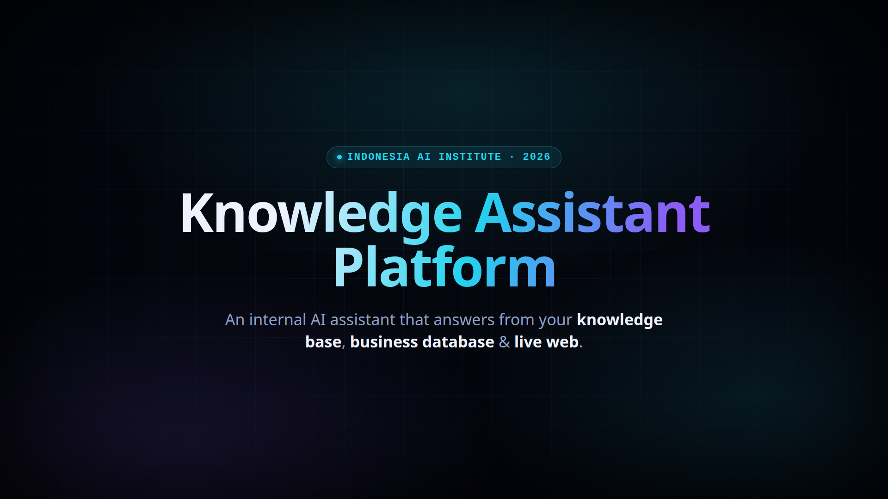

# Internal Company AI Assistant Platform

A web-based AI chatbot that answers internal company questions using three grounded
sources: an internal markdown **Knowledge Base** (SOPs/docs), a **PostgreSQL** business
database (for data-analytics questions), and live **Web Search** for anything outside
internal scope. Built for the IAII Software Engineer Test.

See [`docs/ARCHITECTURE.md`](docs/ARCHITECTURE.md) for the full Architecture / Technical
Design Document (Question 1).

## Demo Video

A motion-graphics walkthrough of the architecture and request flow (by Noval Faturrahman):

[](docs/media/demo.mp4)

▶️ [`docs/media/demo.mp4`](docs/media/demo.mp4) — click the thumbnail to play.

## Short Description

The assistant is a RAG + tool-calling agent: a FastAPI backend sends the user's message
and a set of MCP-exposed tools to an OpenAI model, the model decides which tool(s) to
call (`search_knowledge_base`, `query_database`, `web_search`), the backend executes
those calls via an MCP server, and streams the final grounded answer back to a Next.js
chat UI over Server-Sent Events.

## Repository Structure

```
backend/            FastAPI orchestrator (chat API, SSE streaming, MCP client)
frontend/            Next.js chat UI
mcp-server/          MCP server exposing the 3 tools (KB search, DB query, web search)
worker/               Async worker that chunks + embeds knowledge base docs into pgvector
infrastructure/       Postgres init SQL, dummy business data, dummy knowledge base docs
docs/ARCHITECTURE.md  Architecture / Technical Design Document
docker-compose.yaml   Runs all services together
.github/workflows/    CI/CD pipeline
```

## Tech Stack

| Layer | Choice | Why |
|---|---|---|
| Frontend | Next.js 14 (App Router) + Tailwind | Streaming-friendly React framework, fast to build a chat UI in |
| Backend | Python + FastAPI | Best ecosystem for RAG/agent orchestration; native async + SSE support |
| Tool layer | MCP Server (official `mcp` Python SDK, Streamable HTTP transport) | Standardized tool-calling, decoupled from backend orchestration logic |
| LLM | OpenAI (`gpt-4o-mini` by default, configurable) | Reliable function/tool-calling support |
| Database | PostgreSQL + `pgvector` | Single source of truth for both business data and knowledge base embeddings |
| Cache / Queue | Redis | Caches repeated chat answers; backs the async document ingestion queue |
| Web Search | Tavily API | Purpose-built for LLM agent consumption |
| Containerization | Docker + docker-compose | All services run as containers, one command to start |

Full reasoning for every choice is in [`docs/ARCHITECTURE.md`](docs/ARCHITECTURE.md).

## How to Build and Run

### 1. Prerequisites
- Docker + Docker Compose
- An OpenAI API key
- (Optional but recommended) a Tavily API key for the `web_search` tool

### 2. Configure environment
```bash
cp .env.example .env
# then edit .env and set OPENAI_API_KEY (and TAVILY_API_KEY if you have one)
```

### 3. Run everything
```bash
docker compose up --build
```

This starts, in order: `postgres` (with `pgvector` + dummy data seeded automatically via
`infrastructure/postgres/init.sql`), `redis`, `mcp-server`, `worker` (ingests the dummy
markdown docs in `infrastructure/knowledge_base/` into pgvector on startup), `backend`,
and `frontend`.

### 4. Use it
- Frontend: http://localhost:4448
- Backend API: http://localhost:4447 (`/health`, `/chat`)
- MCP server: http://localhost:4446/mcp

Try asking:
- *"How many days of annual leave do employees get?"* → uses `search_knowledge_base`
- *"What were total sales in Jakarta?"* → uses `query_database`
- *"What's the latest news about [some current event]?"* → uses `web_search`

### 5. Run backend tests
```bash
cd backend
pip install -r requirements.txt
pytest
```

### 6. Deploy to a VPS (production, HTTPS)
Single-subdomain deploy behind Caddy (auto-HTTPS), e.g. `https://ask.ftrhq.my.id`:
```bash
cp .env.prod.example .env   # fill in domain + secrets
docker compose -f docker-compose.yaml -f docker-compose.prod.yml up -d --build
```
Frontend is served at `/`, backend proxied under `/api`; only ports 80/443 are
exposed. Full walkthrough (DNS, firewall, TLS, updates) in
[`docs/DEPLOY.md`](docs/DEPLOY.md).

## How AI Coding Agents Were Used

This project was built with heavy use of Claude Code (Anthropic's CLI coding agent) as a
pair-programming tool:

1. **Design phase (Question 1):** discussed the architecture interactively mandatory
   components (frontend/backend/DB) plus plus-point components (MCP server, Redis
   cache/queue) and had the agent draft `docs/ARCHITECTURE.md` from that discussion,
   iterating on tech stack choices (Python/FastAPI vs Go, OpenAI vs Claude, Tavily vs
   SerpAPI) before finalizing.
2. **Implementation (Question 2):** the agent scaffolded the repo structure and generated
   the initial implementation of each service (FastAPI orchestrator, MCP tool server,
   ingestion worker, Next.js chat UI, Postgres schema + dummy data, docker-compose,
   CI workflow) based directly on the design document, so the code traces back to
   explicit, understood design decisions rather than being generated blind.
3. Repository conventions the agent follows are documented in [`CLAUDE.md`](CLAUDE.md)
   (e.g. the `query_database` tool must always remain read-only, SSE event shape must
   stay consistent between backend and frontend).

All architectural decisions, trade-offs (e.g. single Postgres instance with `pgvector`
instead of a separate vector DB, MCP over Streamable HTTP instead of stdio for
cross-container communication, caching final answers rather than embeddings) were made
and can be explained/justified directly see `docs/ARCHITECTURE.md` for the reasoning
behind each.

## CI/CD

`.github/workflows/ci.yml` is a single pipeline covering all five stages:

| Stage | Job | What it does |
|---|---|---|
| **1. Unit Testing** | `backend-unit-tests` | Runs `pytest -v` against the backend unit suite |
| **2. Integration Testing** | `integration-tests` | Spins up a PostgreSQL service, applies the schema, then runs `pytest -v -m integration` |
| **3. Build** | `frontend-build` + `build-images` | Next.js production build check and Docker image builds for every service |
| **4. Version Release** | `release-and-push` + `github-release` | On a `v*.*.*` tag: cuts a GitHub Release with auto-generated notes |
| **5. Push to GHCR** | `release-and-push` | Logs in and pushes versioned Docker images for all services to `ghcr.io` |

Stages 1–3 run on every push/PR; stages 4–5 run only on tagged releases
(`git tag v1.0.0 && git push --tags`).
